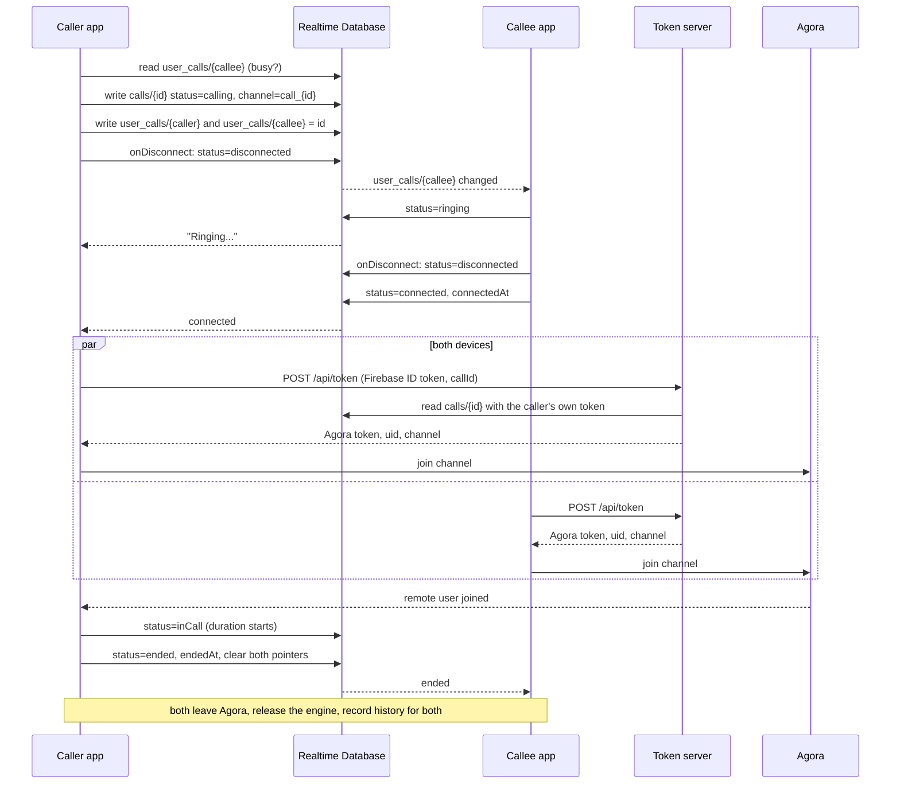

# ConnectCall

> Connect with anyone, anywhere.

A 1-to-1 audio and video calling application built with Flutter, using Agora for
real-time media, Firebase Realtime Database for authentication, presence, call
signaling and call history, and a small token server that authorises each call.

> **Status:** in development. The feature checklist below tracks what is
> actually working, not what is planned.

---

## Features

Checked items are implemented and verified on device.

**Authentication**
- [x] Registration (name, email, password, confirm password)
- [ ] Login (email + password)
- [ ] Logout
- [x] Session persistence across app restarts

**Users**
- [x] User list with avatar, name and live online/offline status
- [ ] Search users
- [ ] View and edit own profile

**Calling**
- [ ] 1-to-1 audio call
- [ ] 1-to-1 video call
- [x] Incoming call screen with accept / reject
- [ ] End call from either side
- [ ] Call state handling: calling, ringing, connected, ended, rejected, missed, busy, failed, disconnected

**Call controls**
- [ ] Mute / unmute microphone
- [ ] Speaker on / off
- [ ] Camera on / off
- [ ] Switch front / rear camera

**Call history**
- [x] Per-user record of caller/callee, type, direction, time, duration, status
- [x] Missed call indicator

**Cross-cutting**
- [x] Light and dark themes
- [ ] Runtime permission handling (granted, denied, permanently denied)
- [ ] Offline / no-network handling
- [ ] Loading, empty and error states throughout

---

## Tech stack

| Concern | Choice |
|---|---|
| Framework | Flutter 3.47.3 (Dart 3.13.3), stable channel |
| State management | Riverpod 3.x |
| Navigation | go_router 18.x |
| Real-time media | Agora RTC Engine 6.x |
| Auth | Firebase Authentication (email + password) |
| Database / signaling | Firebase Realtime Database |
| Call authorisation | Node.js token server on Vercel (`agora-token`, `jose`) |
| Permissions | permission_handler |

### Why Agora

The call controls the brief asks for — mute, speaker routing, camera toggle,
front/rear switch — are first-class APIs on Agora rather than things to
reimplement.

Raw `flutter_webrtc` was considered and rejected: it would mean owning SDP
negotiation, ICE, STUN/TURN hosting and manual audio routing, which is a poor
trade for an assignment where the graded outcome is that calls work. ZEGOCLOUD's
prebuilt UIKit was rejected for the opposite reason — it ships the entire call
screen, leaving little Flutter work to show or explain.

Importantly, Agora only carries media once both peers are in the same channel.
It does **not** tell a device that someone is calling it. That signaling layer is
written from scratch here (see Architecture).

### Why a token server

The Agora project runs in **secured mode**: every channel join needs a token
signed with the project's App Certificate. Agora no longer offers App-ID-only
"testing mode" for new projects, and it would be the weaker choice anyway — an
App ID is compiled into the APK, so anyone holding the APK could extract it and
use the project's quota.

The certificate must never ship inside the app, because it can be extracted from
an APK and used to mint tokens for any channel. So a small server holds it and
issues one token per call, only to that call's two participants (see
Architecture → Token server).

### Why Realtime Database rather than Firestore

Presence — the online/offline dot — is the deciding factor. Firestore has no
server-side disconnect hook, so a crash, a killed app or lost signal leaves a
user marked "Online" indefinitely. Realtime Database's `onDisconnect()`
registers the write with the server at connect time, so it fires however the
connection drops.

RTDB's weaker query support is not a constraint at this scale: history is a
single `orderByChild('startedAt').limitToLast(50)` and contact search is a
prefix query.

### Why Riverpod

Call state has to react to database events and Agora engine callbacks that
originate outside the widget tree, so a `BuildContext`-free container is a
better fit than Provider. Riverpod also composes streams (auth state, user list,
the active call node) declaratively, which keeps the call lifecycle in one
testable object instead of spread across three screens.

---

## Architecture

```
lib/
├── core/
│   ├── config/        build-time env (dart-define)
│   ├── constants/     app constants + database paths
│   ├── router/        go_router config and route names
│   ├── theme/         colour tokens, light/dark themes
│   └── utils/         formatters, validators, error mapping
├── models/            immutable data classes
├── services/          Firebase, Agora, signaling, tokens - no Flutter imports
├── providers/         Riverpod providers wiring services to UI
├── screens/           one folder per feature area
├── widgets/           shared presentational widgets
└── main.dart

token-server/
└── api/token.js       Vercel serverless function issuing Agora tokens

database.rules.json    Realtime Database security rules
```

Business logic lives in `services/` as plain Dart with no widget dependency, so
it is unit-testable in isolation. `providers/` is the only layer that knows
about both a service and the UI. Screens read state and dispatch intent; they do
not talk to Firebase or Agora directly.

### Database schema

```
users/{uid}                    profile, isOnline, lastSeen
calls/{callId}                 live signaling node, watched by both peers
user_calls/{uid}               pointer to the user's active call, if any
call_history/{uid}/{callId}    per-user immutable record
```

Access is enforced server-side by `database.rules.json`: users can only write
their own profile, a call is readable only by its two participants, and each
user's history is readable only by that user.

### Token server

`POST /api/token` with the user's Firebase ID token as a bearer token and a
`callId` in the body. It returns `{ token, rtcUid, channelName, expiresIn }`.

1. The Firebase ID token is verified against Google's public signing keys,
   which proves who is asking.
2. `calls/{callId}` is read through the Realtime Database REST API **using the
   caller's own ID token**. The database rules only allow a call's two
   participants to read it, so a successful read proves the requester belongs
   to that call — no Firebase service account is needed.
3. A token is signed for that call's channel with the App Certificate, which
   exists only in the server's environment.

The channel name is taken from the database and the Agora uid is derived from
the verified Firebase uid, so a client cannot request a token for another
channel or impersonate the other participant. Tokens are refused for calls that
have already ended.

In the app, all call code goes through a single `AgoraTokenProvider` interface,
so the token host can change without touching the call flow.

### How a call is established

Agora carries audio and video once two devices are in the same channel, but it
has no concept of "ringing" someone. That signaling is built on the Realtime
Database: one shared node per call, `calls/{callId}`, which **both** devices
watch. Every state change is written by one side and observed by the other,
so behaviours like "the caller cancels and the callee's ringing screen closes"
need no special handling.



Step by step:

1. **Pre-flight.** The caller's app checks it is actually connected to
   Firebase (`.info/connected`), warns if the callee is offline, and requests
   microphone (and, for video, camera) permission.
2. **Place.** `SignalingService.placeCall` checks the callee's
   `user_calls/{uid}` pointer, and refuses with "busy" if it points to a live
   call. Otherwise it writes the call node, points both users' pointers at it,
   and registers a server-side `onDisconnect` that marks the call
   `disconnected` if the caller's app dies.
3. **Ring.** The callee's app listens to its own pointer from the app root, so
   an incoming call is caught on any screen. It shows the incoming screen and
   writes `ringing`, which moves the caller's screen from "Calling..." to
   "Ringing...". The caller owns a 45-second timeout that marks the call
   `missed`.
4. **Answer.** Accept checks permissions, registers the callee's own
   `onDisconnect`, and writes `connected`.
5. **Media.** Each device, on seeing `connected`, asks the token server for an
   Agora token, then joins the channel. When each side's `onUserJoined` fires,
   the status becomes `inCall` and the duration timer starts. Talk time is
   measured from media arriving, not from the Accept tap.
6. **End.** Either side's End writes `ended`, cancels its disconnect handler,
   and clears both pointers. Both devices see the terminal status, leave the
   channel, release the camera and microphone, and write the call into both
   participants' histories. The screen shows the outcome for two seconds, then
   closes.

**Every other outcome is a different terminal status on the same node:**
`rejected` (callee declined), `missed` (no answer or caller cancelled),
`busy` (callee on another call), `failed` (token or media could not be set
up), `disconnected` (media dropped, or an app was killed, detected by the
server-side `onDisconnect`). A brief network drop is not an ending: Agora
reconnects on its own and the screen shows "Reconnecting...".

The call controller (`CallController`) is the one place that reconciles the
database node with the media layer, and it follows one rule: **only the
database decides a call is over.** When the media layer reports a problem, the
controller writes the matching terminal status to the node, so the other
device learns the same outcome through the same path.

---

## Setup

### Prerequisites
- Flutter 3.47.3 or later (stable)
- Android SDK with a device or emulator on API 24+
- A Firebase project with Email/Password auth and Realtime Database enabled
- An Agora project (secured mode) — you need its App ID and primary certificate
- A Vercel account for the token server, and Node.js 20+

### 1. App

```bash
git clone https://github.com/asitgiri1234/connectcall.git
cd connectcall
flutter pub get
```

Connect the app to your own Firebase project:

```bash
dart pub global activate flutterfire_cli
flutterfire configure
```

This generates `lib/firebase_options.dart` and
`android/app/google-services.json`. Both are gitignored — each developer
generates their own against their own Firebase project.

Deploy the database security rules:

```bash
firebase deploy --only database
```

### 2. Token server

```bash
cd token-server
npm install
vercel link
vercel env add AGORA_APP_ID production
vercel env add AGORA_APP_CERTIFICATE production
vercel env add FIREBASE_PROJECT_ID production
vercel env add FIREBASE_DATABASE_URL production
vercel deploy --prod
```

| Variable | Value |
|---|---|
| `AGORA_APP_ID` | Agora project App ID |
| `AGORA_APP_CERTIFICATE` | Agora primary certificate — a secret, server-side only |
| `FIREBASE_PROJECT_ID` | Firebase project id |
| `FIREBASE_DATABASE_URL` | Realtime Database URL, including the region host |

### 3. App configuration

Build-time values are injected with `--dart-define` and never committed.
Copy the template:

```bash
cp dart_defines.example.json dart_defines.json
```

```json
{
  "AGORA_APP_ID": "your-agora-app-id",
  "TOKEN_SERVER_URL": "https://your-token-server.vercel.app"
}
```

`dart_defines.json` is gitignored. Then run:

```bash
flutter run --dart-define-from-file=dart_defines.json
```

Release build:

```bash
flutter build apk --release --dart-define-from-file=dart_defines.json
```

The App ID and token server URL are identifiers, not secrets, and end up inside
the APK. The App Certificate is never given to the app.

---

## Running the tests

```bash
flutter test
```

Unit tests in `test/` cover the logic that would otherwise fail silently as
wrong data on screen: call-status rules (which states are terminal, and that an
unknown status degrades to `failed`), call-history pairing (mirrored entries for
both participants, talk time measured from connection rather than from placing
the call, side-aware "Missed" vs "No answer", and only the keys the database
rules allow), day grouping, defensive parsing of malformed user records,
formatters and form validators.

## Testing a call

A 1-to-1 call needs two devices. Register two accounts, sign in to one on each
device, and call between them. An emulator works as one endpoint, but its
microphone loopback is unreliable — two physical devices give a truer result.

---

## Known limitations

_Tracked as the project progresses._

- The token server runs on Vercel's free tier, so the first call after a period
  of inactivity may take a moment longer while the function cold-starts.
- Agora tokens are issued for one hour. Renewal for calls longer than that is
  not yet implemented.
- The user directory streams the whole `users` node. That is fine at assignment
  scale; a large user base would need paging and server-side search.

---

## AI tools used

Developed with assistance from **Claude (Anthropic)** via Claude Code, used for
scaffolding, implementation and code review. All architectural decisions —
calling SDK, database choice, state management, token server — were made
deliberately with the trade-offs documented above, and the codebase is
understood end to end.
